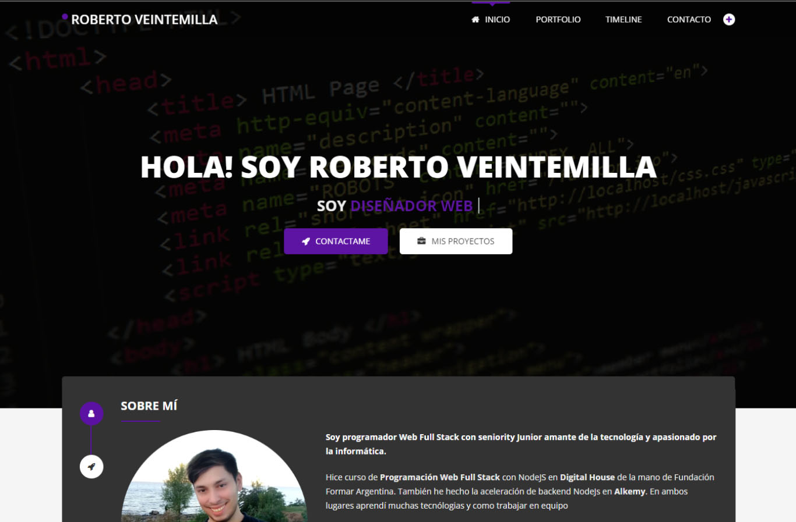

# Portfolio Roberto Veintemilla



## Objetivo:

 Es mostrar mis proyectos realizados, las distintas herramientas que manejo, mi experiencia en distintos empleos y estudios cronológicamente y un apartado para dejarme un mensaje.

## Tecnologías:
  
            

## Demo

<a href="https://p0ep6c-3000.preview.csb.app/" target="_blank">Hazme click para ver el proyecto</a>

## Pruébalo tú mismo

#### Ingrese a su terminal de comandos:

- Clone el proyecto

```
git clone https://github.com/Robertlean/portfolioRobertV
```

- Ingrese a la carpeta del proyecto

```
cd portfolioRobertV
```

- Instale las dependencias

```
npm install
```

- Levante el servidor (puerto 3000)

```
npm start
```

#### En su navegador favorito ingrese la siguiente URL:

http://localhost:3000/